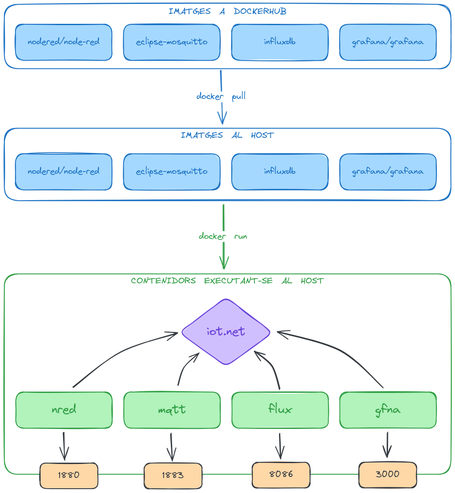

# SMX1 IoT Server

Aquest repositori conté els _shell scripts_ necessaris per crear i esborrar
els contenidors que han de córrer en el servidor IoT.


### Esquema de Docker

Una imatge de docker està formada per un conjunt de fitxers amb un sistema que
permet l'execució d'un o més programes dins d'un entorn d'execució diferent al
del host. Per exemple, perquè el programa que s'executa és més nou que el que
té instal·lat el host, o perquè usa llibreries més noves, etc.

La comanda `docker pull` es baixa una imatge des de dockerhub al host. A
docker pull es mantenen diferents versions de cada imatge, i per defecte
sempre es baixa la darrera (la més nova).

La comanda `docker run` crea un contenidor a partir d'una imatge i executa els
programes que s'indiquen en un _script_. En aquest moment es dona el nom al
contenidor (`mqtt`, `nred`, etc).



Tots els contenidors comparteixen la xarxa `iot.net` (subnet i gateway) per
facilitar la comunicació entre ells i fixars les adreces IP. A més, cada
contenidor publica un port en el host per tal de fer accessible el servei
corresponent. Així, si et connectes a http://localhost:3000 de fet estàs
accedint al contenidor de grafana `gfna`.

### Automatització

Per tal de fer fàcilment _exportables_ els contenidor que es necessiten al
servidor IoT, s'han creat uns _shell scripts_ que fan tota la feina.

##### `create-all.sh`
  1. Es baixa o actualitza (en cas que ja estiguin baixades) les imatges
     necessàries.
  1. Crea la xarxa `iot.net`.
  1. Engega els contenidors `nred`, `mqtt`, `flux` i `gfna`.

##### `remove-all.sh`
   1. Atura els contenidors `nred`, `mqtt`, `flux` i `gfna`.
   1. Esborra els contenidors `nred`, `mqtt`, `flux` i `gfna`.
   1. Esborra la xarxa `iot.net`.


### Procediment

A Ubuntu Server, instal·la `docker` i afegeix el teu usuari al grup `docker`:

```sh
sudo apt install docker.io
sudo usermod -aG docker $(id -u)
```

Reinicia la sessió per activar els canvis. Amb `id` has de veure que el teu
usuari pertany al grup `docker`.

Clona aquest repositori en el directori `$HOME/iot-server` i executa l'script
que ho crea tot:

```sh
cd
git clone https://github.com/rocher/smx1_iot-server iot-server
./iot-server/bin/create-all.sh
```
